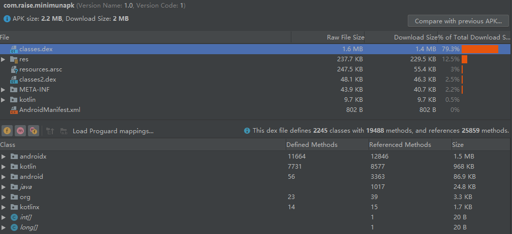
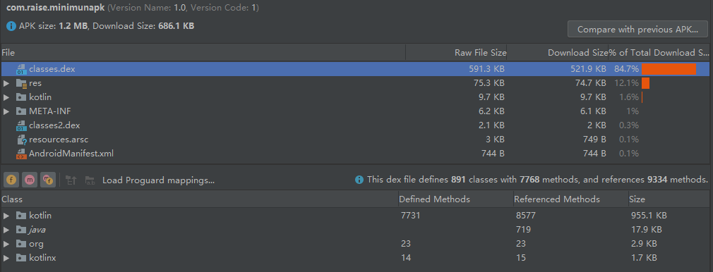
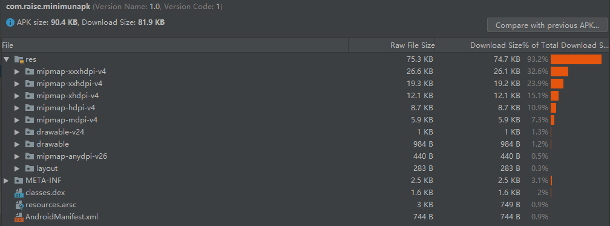
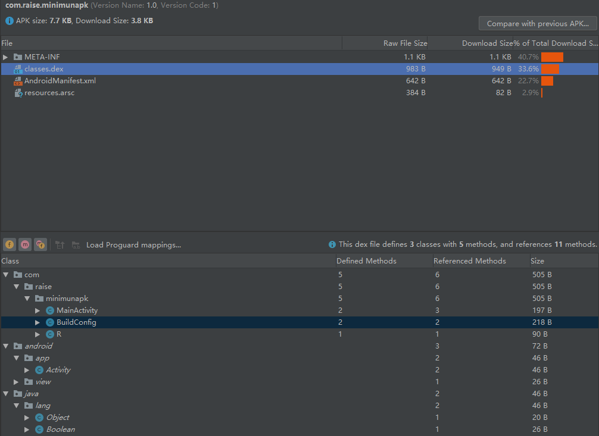
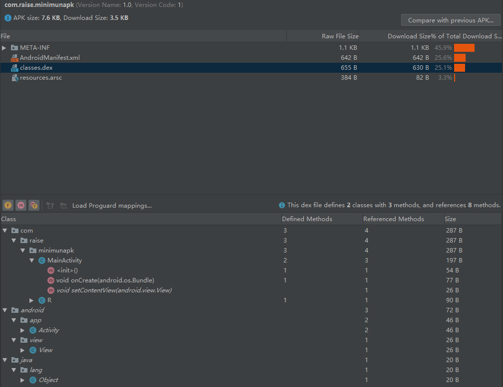
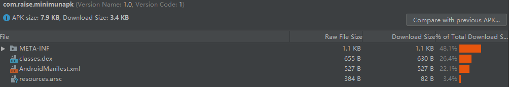
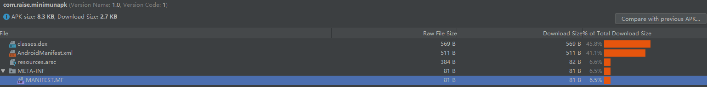

# 最小启动APK大小实践

在做APK文件的瘦身的实践中，为了了解清楚APK文件中到底哪些是必须的，哪些是可以删除的，特地做了本次实践。

## 使用AS创建新项目
平时开发，我们都是从AS新建项目开始，不断的编码，丰富APK功能；自然APK的文件越来越大。
这里我们试试当创建一个新项目时，不加任何自己的代码，编译生成一个APK的内容和大小；
环境：`AndroidStudio 4.0`
1.默认生成APK大小：**2.2M**


参考上图，`classes.dex`文件占用空间最大，占比79.3%；再进一步选中后，发现androidx相关库的代码占用1.5M；
我们知道androidx是google的扩展框架，不是一个APK文件必须的，所以可以去掉相关依赖；

```
去除androidx：
ConstraintLayout使用LinearLayout代替
Theme.AppCompat.Light.DarkActionBar使用android:Theme.Black.NoTitleBar代替
AppCompatActivity使用Activity代替
```

2.去除androidx库后的APK大小：**1.2M**


最大文件依然是`classes.dex`，这次是kotlin相关库占用955.1KB。
kotlin也是google后期进入的，可以去除，使用Java代替。
```
去除kotlin:
删除kotlin相关gradle插件，依赖
MainActivity.kt替换为MainActivity.java
```

3.去除kotlin相关库后的APK大小：**90.4K**


去除androidx和kotlin后，APK大小仅为90.4K，比原来的2.2M,减少了近96%大小；
目前占比最大的是res/下的文件，这里面都是使用到的常量资源:icon（应用图标，APK可以不配置图标），activity.xml（activity的布局文件，可以使用View对象代替），可以全部去除；

```
去除res/:
直接删除res目录下所有文件
setContentView(new View(this));
```
4.去除res资源文件目录后的APK大小：**7.7K**

如上图，占比最大的是MEAT-INF，这是V1签名的相关内容，暂时先不优化；
点进`classes.dex`发现BuildConfig这个类，这个类是AS在编译时自动生成的，程序中可以不适用，所以可以去除；
```
去除BuildConfig:
// 在build.gradle中配置
android.applicationVariants.all { variant ->
    variant.generateBuildConfig.enabled = false
}
```

5.去除BuildConfig后的APK大小：7.6K


如上图，AndroidManifest.xml占比较大，考虑将该文件内的内容优化；
```
//将Activity申明简化，后续使用adb命令启动
//注意一定要配置android:exported="true"，不然adb不能启动界面
    <application>
        <activity
            android:exported="true"
            android:name=".MainActivity" />
    </application>
```
6.优化清单文件后，APK的下载大小：3.4K


MEAT-INF文件夹下，主要包含V1签名信息，可以考虑去除V1签名信息文件；仅使用V2签名，生成的APK文件仅可安装于Android 7.0及之后的系统中。

```
//去除V1签名，配置签名时
    signingConfigs {
        signV2 {
            storeFile file("../sign.jks")
            storePassword "xxx"
            keyAlias "xxx"
            keyPassword "xxx"
            v1SigningEnabled false
            v2SigningEnabled true
        }
    }
```
7.去除V1签名信息后，APK的下载大小仅2.7K；

## 使用Build Tools工具编译生成APK

根据上一小节经验，我们将app目录下的资源单独拷贝出来，用作源码，使用安卓的SDK构建工具集，就可以编译生成APK；
> 这个APK也包含四个部分：
> 1. resources.arsc
> 2. classes.dex
> 3. AndroidManifest.xml
> 4. META-INF

1. 编译资源文件，生成resources.arsc
`aapt2 compile --dir app/src/main/res/ -o package/res.zip`
- --dir 指定资源路径
- -o 指定输出路径

编译完成后，会在package文件夹下看到res.zip这个文件；可以尝试解压看看里面内容；

2. 连接manifest.xml文件，生成R文件，生成初步apk文件
`aapt2 link package/res.zip -I D:/android-sdk-windows/platforms/android-29/android.jar --java package/ --manifest app/src/main/AndroidManifest.xml -o package/res.apk`
- -I：必要参数，指定 android.jar 目录，因为 xml 中可能使用到了例如 android:id 等自带的 android 命名空间
- o：指定输出 apk 路径
- —java：指定生成的 R 文件的路径
- —manifest：必要参数，Manifest 文件中包含了 app 的包名和 application id

初步apk文件内容包含resources.arsc和AndroidManifest.xml

3. 编译 .java 文件为 .class 文件,在转换成.dex文件；生成classes.dex
`javac -encoding utf-8 -target 1.8 -bootclasspath D:/android-sdk-windows/platforms/android-29/android.jar app/src/main/java/com/raise/practice/*.java package/com/raise/practice/R.java -d package/`
`d8 package/com/raise/practice/*.class --classpath D:/android-sdk-windows/platforms/android-29/android.jar --output ./`

4. 将dex文件添加进apk
`aapt add package/res.apk classes.dex`

5. 对齐apk
`zipalign 4 package/res.apk package/app-unsigned-aligned.apk`

6. 签名
`apksigner sign --ks key.jks --out package/app-release.apk package/app-unsigned-aligned.apk`


参考：
[APK 的前世今生：从 Android 源码到 apk 的编译打包流程](http://www.manongjc.com/article/59926.html)